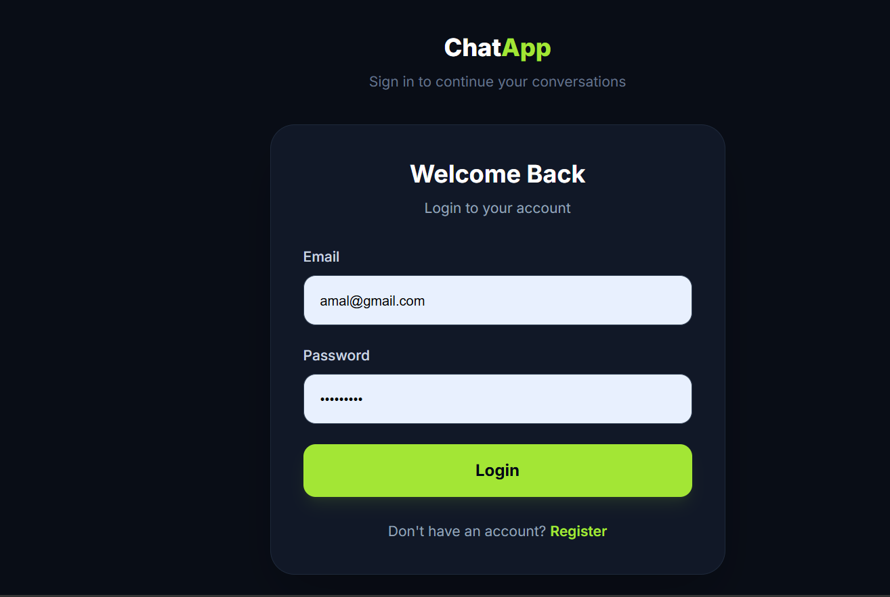
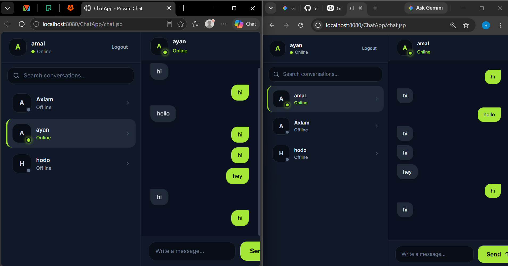

# Java Web Chat Application

A real-time web-based chatting application built with **Java, JSP, WebSocket, Payara Server, and MySQL**. The application allows users to communicate through a browser with persistent user and message data.

## Features

* User Login & Registration
* Real-time Messaging
* Online / Offline Status
* Multiple Users
* Message History
* MySQL Database
* WebSocket Communication
* Browser-based Chat Interface

## Screenshots

### Login

### Chat

## Technologies

* Java
* JSP
* Java WebSocket
* Payara Server
* MySQL
* JDBC
* HTML / CSS
* JavaScript
* NetBeans IDE

## How It Works

The application uses **WebSocket** technology for real-time communication between users. **Payara Server** handles the Java web application and WebSocket connections, while **MySQL** stores user and message data.

## Purpose

This project was developed to practice **Java web development, WebSocket communication, server-side programming, database integration, and real-time chat systems**.

## Author

**Hajira Yousuf**

Software Engineering Student
